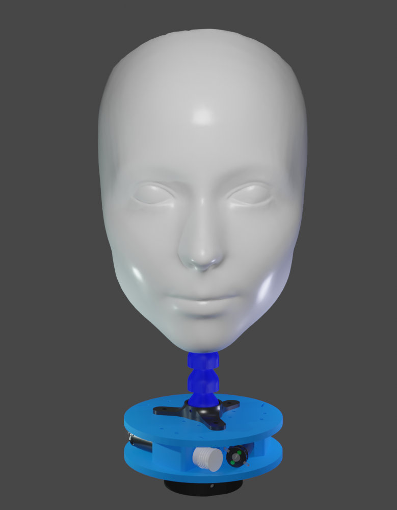

# Humasoft Blender Models

This repository contains the HumaSoft models stored in `.blend` files, which have been prepared to be able to interact with them through python scripts, giving functionality to the model within the Blender environment and being able to extract information about it in real time.

## Soft-Neck

### Information:

 

  
This 3D model has been obtained from a `.STL` file. Once the model has been imported into Blender, it has been resized to real size. The mesh has been edited, creating and separating each of the individual objects and later smoothing it for a better appearance. BSDF materials have been applied to each object and a 3D print-looking procedural texture has been created for the soft material. A skeleton has been incorporated into the neck which produces a deformation in the movement of the links, simulating a soft deformable material. Each of the bones who participate in the movement, contains a constraint that copies the rotation of its parent bone, producing a proportional movement of all of them. In this way, the main parent bone originates the movement of the rest of the bones.
The script will allow, in real time, to carry out the transformation of the orientation *pitch-roll* to *inclination-orientation* or vice versa, allowing us to select the desired **input**, transfer the orientations to the main parent bone, calculate the **Inverse Kinematic** from the distances between points where the thread is located, get the amount of thread that each motor must pick up or drop to achieve the desired orientation and calculate the number of motor rotations. Finally, these rotations will be applied to simulate the movement of the coils.

### Videos:
* [Soft-Neck simulation using Blender](https://youtu.be/4EPMhqij_IM)
* [Soft-Neck assembly and movement demostration](https://youtu.be/V3eANdP6U_4)
